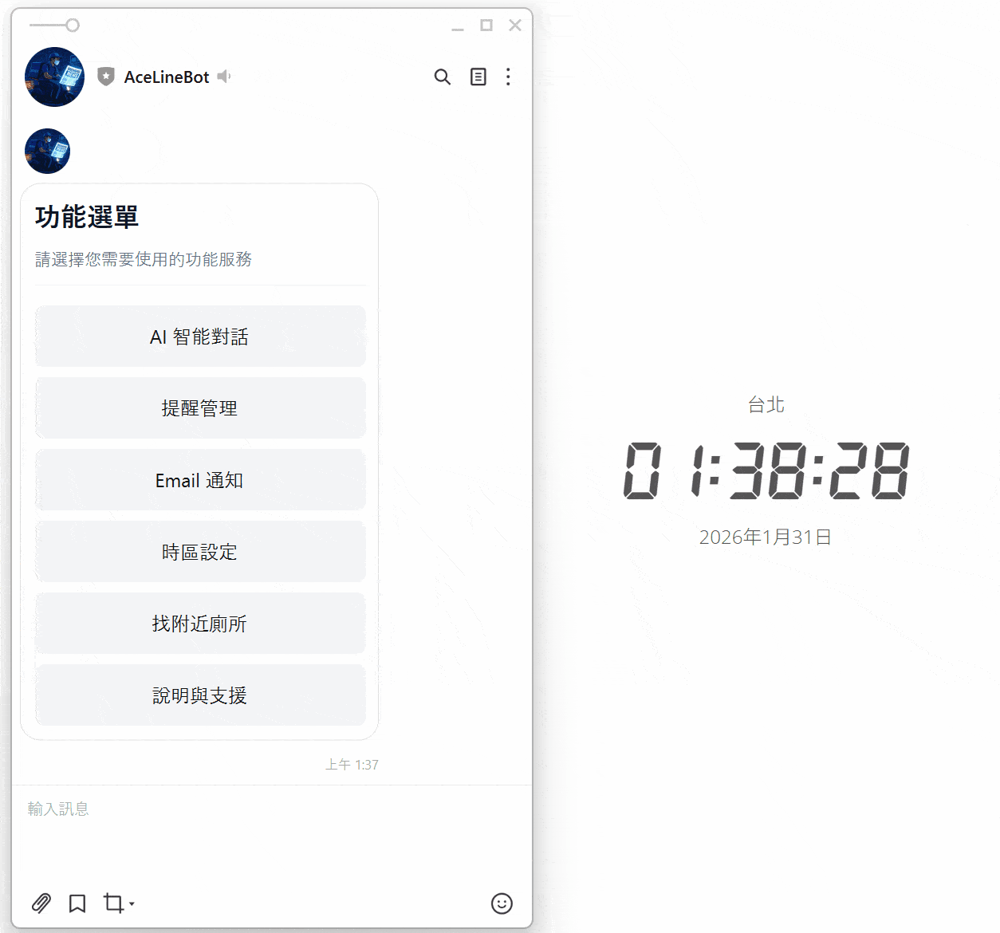
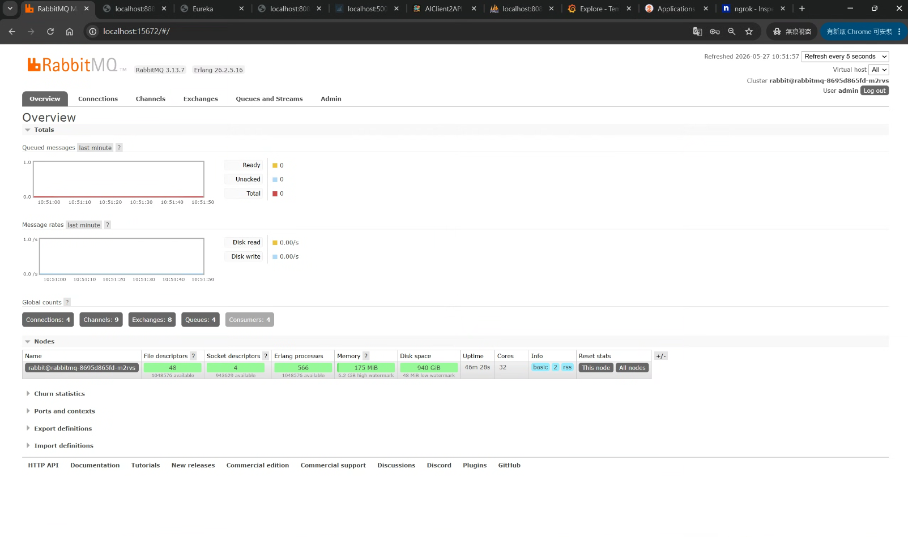
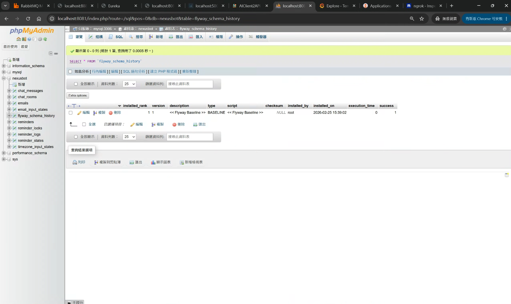
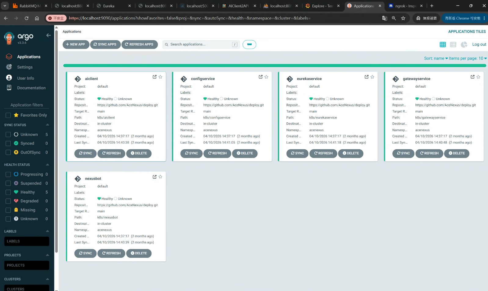
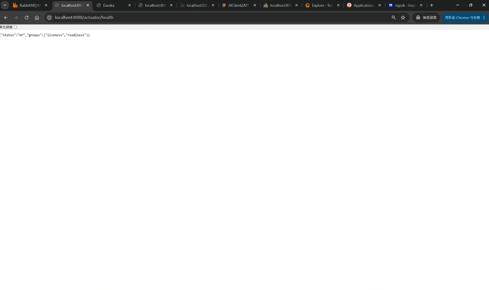
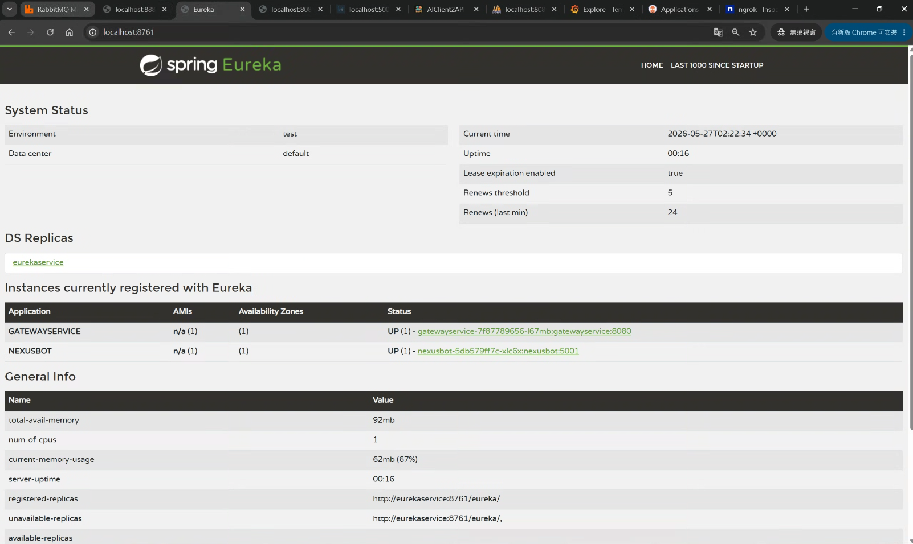
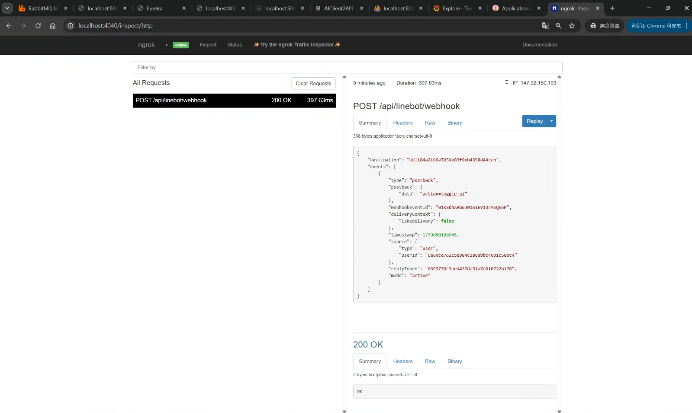
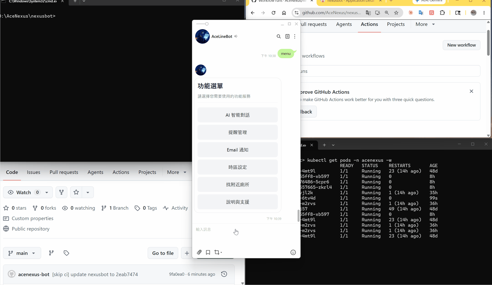

# AceNexus 專案架構實戰解析

[**AceNexus**](https://github.com/AceNexus) 是一套自主設計並實作的微服務系統，以 **NEXUSBOT**（LINE Bot 智慧助理）作為核心應用服務，並以 Spring Cloud 生態系建構支撐它的基礎設施。

---

## 1. 系統概覽

### 作品：NEXUSBOT

[**NEXUSBOT**](https://github.com/AceNexus/NEXUSBOT) 是一個基於 **Java 17 + Spring Boot** 的 LINE Bot 服務，提供 AI 對話、排程提醒等功能。



### 基礎設施

為了支撐 NEXUSBOT，建構了三個核心基礎設施服務：

| 服務 | 職責 |
|------|------|
| **EUREKASERVICE** | 服務註冊與發現，管理所有節點生命週期 |
| **CONFIGSERVICE** | 集中管理所有服務的環境配置，支援熱更新 |
| **GATEWAYSERVICE** | 系統唯一入口，負責路由轉發與 JWT 驗證 |

**服務啟動順序（依賴關係）：**

```
RabbitMQ → CONFIGSERVICE → EUREKASERVICE → GATEWAYSERVICE → NEXUSBOT
```

---

## 2. 核心設計重點

### 1. JWT 集中驗證（GATEWAYSERVICE）

所有請求進入系統前，由 Gateway 的 `JwtAuthFilter` 統一驗證 JWT Token，驗證後將 `X-User-ID` 與 `X-User-Name` 注入下游 Header。

**好處：** 各業務服務無需重複實作驗證邏輯，職責單一。

### 2. 配置熱更新（CONFIGSERVICE + RabbitMQ）

配置變更時，透過 `/actuator/busrefresh` 廣播至 RabbitMQ，所有微服務即時套用新配置，**無需重啟任何服務**。

**好處：** 生產環境可安全調整參數，零停機。

### 3. GitOps 全自動部署

push code → GitHub Actions 建置 Docker 映像 → 自動更新 `deploy` 儲存庫的 YAML → ArgoCD 偵測變更 → 同步至 K8s 叢集。

**好處：** 部署流程完全自動化，`deploy` 儲存庫是唯一的事實來源。

---

## 3. 服務詳解

### NEXUSBOT — LINE Bot 智慧助理

#### 核心設計：責任鏈模式 (Chain of Responsibility)

為處理 LINE Messaging API 傳來的多樣化事件（文字、圖片、Postback），採用責任鏈模式依優先順序串接多個事件處理器：

**管理員指令 → AI 閒聊 → 預設回覆**

匹配成功即截斷，不匹配則流轉至下一層。新增功能處理器不影響現有邏輯，符合開閉原則。

下圖透過 ngrok 監控確認 LINE 平台成功回呼 `/api/linebot/webhook`，事件類型為 `postback`（`action=toggle_ai`），服務回應 **200 OK**：



#### 關鍵功能實作

- **AI 整合：** 透過 **Groq API** 整合 Llama 3.1 模型，提供低延遲的智慧對話能力。
- **排程提醒：** 支援單次、每日、每週的智慧提醒，並處理跨時區轉換邏輯。
- **資料庫遷移 (Flyway)：** 使用 Flyway 進行 MySQL Schema 版本控制，確保各環境（Local/Dev/Prod）結構一致。
- **可觀測性：** 整合 **MDC TraceID** 追蹤請求鏈路，搭配 Grafana Tempo 視覺化分散式追蹤。
- **基礎設施整合：** 透過 Spring Cloud Config 抓取動態配置，利用 RabbitMQ 處理訊息排隊。

Flyway `flyway_schema_history` 確認 Schema 已正確套用 Baseline：



Grafana Tempo 顯示 nexusbot 服務的 Trace 記錄，涵蓋所有 HTTP 操作：



---

### GATEWAYSERVICE — 統一 API 網關

[**GATEWAYSERVICE**](https://github.com/AceNexus/GATEWAYSERVICE) 作為系統唯一入口，承載路由轉發與全域安全性檢查。

#### 關鍵實作
- **JwtAuthFilter：** 自定義全域過濾器，驗證請求標頭中的 JWT Token，校驗成功後將 `X-User-ID` 與 `X-User-Name` 注入下游請求，消除各服務重複驗證邏輯。
- **GatewayLoggerFilter：** 記錄所有請求的 Meta-data（Request ID、Path、IP、Duration），提升系統可觀測性。
- **路徑重寫 (Path Rewriting)：** 透過 `StripPrefix` 過濾器，將 `/api/service-name/**` 格式的外部請求精確導向內部服務。

---

### CONFIGSERVICE — 分散式配置中心

[**CONFIGSERVICE**](https://github.com/AceNexus/CONFIGSERVICE) 實現「配置即代碼 (Configuration as Code)」，集中管理所有服務的環境參數。

#### 關鍵實作
- **Git 儲存後端：** 所有配置檔存放於專屬 Git 儲存庫，實現版本控制與變更追蹤。
- **敏感資訊加密 (JCE)：** 使用 Java Cryptography Extension 對稱加密，Git 檔案中以 `{cipher}` 前綴標記，Config Server 傳送前自動解密。
- **動態熱更新 (Spring Cloud Bus)：** 整合 **RabbitMQ**，配置變更時透過 `/actuator/busrefresh` 廣播，所有微服務即時套用新配置而無需重啟。
- **Secret 管理：** 資料庫憑證、API Keys 等敏感資訊不進入 Git，統一透過 **K8S Secrets** 手動建立並在 Pod 中引用。

RabbitMQ Management 確認訊息佇列正常運作：



---

### EUREKASERVICE — 服務註冊與發現

[**EUREKASERVICE**](https://github.com/AceNexus/EUREKASERVICE) 是整個微服務體系的通訊錄，負責管理所有服務實例的生命週期。整合 HTTP Basic Auth 防止未授權節點註冊，支援 local / dev / prod 多環境 Profile，並與 Config Server 深度整合。

下圖為 Eureka Dashboard，**GATEWAYSERVICE** 與 **NEXUSBOT** 均已成功註冊並處於 UP 狀態：



---

## 4. 部署流程（GitOps CI/CD）

部署流程採用 **GitOps 模式**，以 [**AceNexus/deploy**](https://github.com/AceNexus/deploy) 儲存庫作為「單一事實來源 (Source of Truth)」，明確分離開發與維運職責。

### CI：持續整合（GitHub Actions）

每個微服務的 CI 工作流程：
1. 執行 Gradle 單元測試並封裝 JAR。
2. 建置 Docker 映像檔並推送至 **GHCR (GitHub Container Registry)**。
3. 自動更新 `deploy` 儲存庫中對應服務的 `k8s/deployment.yaml` 映像檔標籤。

### CD：持續部署（ArgoCD）

1. **ArgoCD 監控：** 持續監聽 `deploy` 儲存庫的變更。
2. **狀態同步：** 偵測到 YAML 配置變更時，自動將 K8S 叢集狀態同步至最新配置。
3. **零停機更新：** 利用 K8S 滾動更新機制，版本更迭過程中服務始終保持可用。
4. **快速回滾：** 透過 Git Revert 回退 `deploy` 儲存庫配置，ArgoCD 自動同步至前一版本。

ArgoCD 顯示所有服務（configservice、eurekaservice、gatewayservice、nexusbot）均處於 **Healthy** 狀態：



以下為完整 CI/CD 觸發到部署同步的實際操作示範：



### 啟動順序依賴管理

`restart_k8s.sh` 腳本確保服務依正確順序啟動：

1. 中介軟體：RabbitMQ
2. 基礎設施：Config → Eureka
3. 路由與業務：Gateway → Bot

### 網路隧道（ngrok）

LINE Webhook 需要公開的 HTTPS URL，透過 `ngrok-tunnel.sh` 自動建立外部隧道並導向內部 GATEWAYSERVICE（Port 8080）。

---

## 參考連結
- [AceNexus Organization](https://github.com/AceNexus)
- [AceNexus/deploy Repository](https://github.com/AceNexus/deploy)
- [NEXUSBOT Repository](https://github.com/AceNexus/NEXUSBOT)
