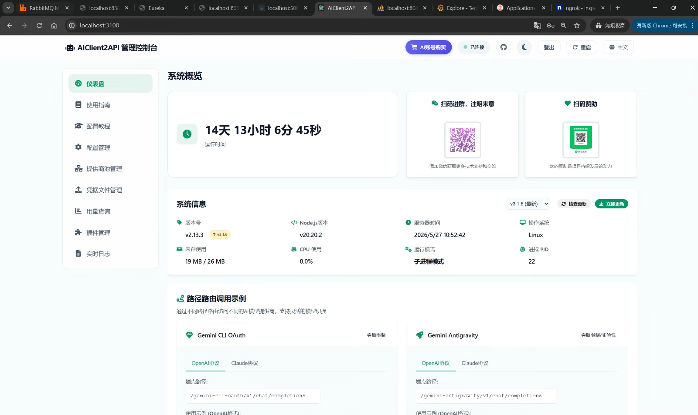

# Java 核心 Bot 架構：NEXUSBOT 實作解析

在 AceNexus 的生態系中，Bot 的開發被作為微服務架構中的一個專業元件。本篇筆記將深入探討基於 **Java (Spring Boot)** 實作的高性能且易於維護的 Bot 系統。

## 實際效果展示

---

## 1. 架構設計：NEXUSBOT

[**NEXUSBOT**](https://github.com/AceNexus/NEXUSBOT) 是基於 **Java 17** 與 **Spring Boot** 建構的核心服務，強調型別安全與企業級的擴展性。

### 核心設計模式：責任鏈模式 (Chain of Responsibility)
為了處理 LINE Messaging API 傳來多樣化的事件（文字、圖片、Postback），NEXUSBOT 採用了責任鏈模式：
- **優先順序處理：** 例如「管理員指令」具有最高優先權，若匹配成功則直接截斷後續處理；若不匹配，則流轉至「AI 閒聊」或「預設回覆」處理器。
- **優點：** 易於新增功能處理器而不影響現有邏輯，符合開閉原則。

### Webhook 實際接收展示

下圖透過 ngrok Traffic Inspector 確認 LINE 平台成功回呼 `/api/linebot/webhook`，事件類型為 `postback`（`action=toggle_ai`），服務回應 **200 OK**：

---

### 關鍵功能實作

#### AI 整合

透過 **Groq API** 整合 Llama 3.1 模型，提供低延遲的智慧對話能力。

#### 排程提醒

支援單次、每日、每週的智慧提醒，並處理時區轉換邏輯。

#### 資料庫遷移：Flyway

使用 **Flyway** 進行 MySQL 版本控制，確保資料表結構在不同環境（Local/Dev/Prod）的一致性。下圖為 `flyway_schema_history` 記錄，確認資料庫 Schema 已正確套用 Baseline：

#### 可觀測性：Grafana Tempo 鏈路追蹤

整合 **MDC (Mapped Diagnostic Context)** 進行 TraceID 追蹤，並透過 Grafana Tempo 視覺化請求鏈路。下圖顯示 nexusbot 服務的 Trace 記錄，涵蓋排程提醒、HTTP PUT/POST 等操作：

#### 基礎設施整合

透過 Spring Cloud Config 抓取動態配置，並利用 RabbitMQ 處理訊息排隊。

---

## 2. 部署與維運

NEXUSBOT 完美融入了現代化的 K8S 部署體系：
- **容器化：** 提供完整的 Dockerfile 與 Docker Compose 配置。
- **K8S 部署：** 包含 Deployment、Service 與 Secret 的 YAML 定義。
- **CI/CD：** 透過 GitHub Actions 自動化測試、掃描 (Trivy) 並推送到 GHCR。

### 服務健康狀態

NEXUSBOT 服務健康狀態（Port 5001）：

---

## 參考連結
*   [NEXUSBOT GitHub Repository](https://github.com/AceNexus/NEXUSBOT)
*   [AceNexus Organization](https://github.com/AceNexus)
