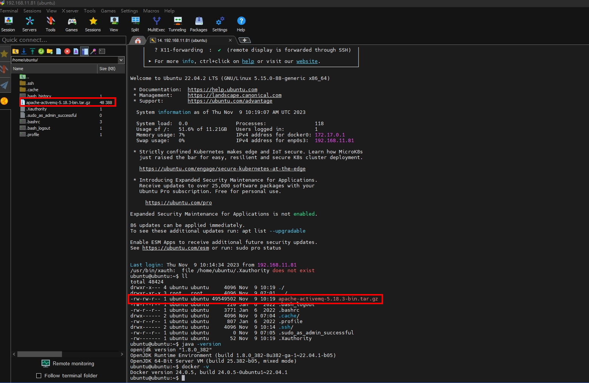

# ActiveMQ 安裝與環境設定

這篇筆記記錄了在 Ubuntu 伺服器上安裝並啟動 ActiveMQ 5.18.3 的完整流程。

---

## 安裝步驟

### 1. 安裝 JDK

```bash
sudo apt install openjdk-11-jdk
```

---

### 2. 下載 ActiveMQ 壓縮檔

前往 [官方下載頁面](https://activemq.apache.org/components/classic/download/) 下載版本 `apache-activemq-5.18.3-bin.tar.gz`。

> 目前放在 ubuntu 資料夾底下



---

### 3. 解壓縮

```bash
tar -xzf apache-activemq-5.18.3-bin.tar.gz
```

---

### 4. 進入解壓縮目錄

```bash
cd /ubuntu/apache-activemq-5.18.3/
```

---

### 5. 確認 ActiveMQ 能否啟動

進入 `bin` 資料夾後執行：

```bash
./activemq start
```


---

### 6. 設定 WebConsole 外部存取

預設 ActiveMQ WebConsole 的 jetty 配置指定 `host` 為 `127.0.0.1`，表示 WebConsole 僅在本地可用。

修改 `/home/ubuntu/apache-activemq-5.18.3/conf/jetty.xml`，將 `host` 改為 `0.0.0.0`。


---

### 7. 開啟 WebConsole

瀏覽器輸入：

```
http://192.168.11.81:8161
```

預設帳號密碼皆為 `admin`，可在 `jetty-realm.properties` 調整。

---
