# Docker 安裝與基礎指令

這篇筆記記錄 Docker 核心概念、在 Ubuntu 上的安裝流程，以及常用指令與安裝 MySQL、Redis、Tomcat 的實作步驟。

---

## 1. 核心概念

Docker 讓開發人員能夠自動化部署、擴展和運行應用程式，核心概念如下：

| 概念 | 說明 |
|------|------|
| **容器 (Container)** | 獨立的小盒子，將應用程式及依賴項打包在一起，確保在不同系統上正常運行 |
| **映像檔 (Image)** | 容器的藍圖，容器是根據映像檔建立的 |
| **Dockerfile** | 製作映像檔的指令文件 |
| **Docker Hub** | 分享和下載映像檔的公共平台 |

---

## 2. 在 Ubuntu 上安裝 Docker

### 步驟一：更新 apt

```bash
sudo apt update && sudo apt upgrade -y
```

### 步驟二：安裝必要套件

```bash
sudo apt install apt-transport-https ca-certificates curl software-properties-common
```

### 步驟三：新增 Docker 官方 GPG 金鑰

```bash
curl -fsSL https://download.docker.com/linux/ubuntu/gpg | sudo gpg --dearmor -o /usr/share/keyrings/docker-archive-keyring.gpg
```

### 步驟四：設定儲存庫

```bash
echo "deb [arch=amd64 signed-by=/usr/share/keyrings/docker-archive-keyring.gpg] https://download.docker.com/linux/ubuntu $(lsb_release -cs) stable" | sudo tee /etc/apt/sources.list.d/docker.list > /dev/null
```

### 步驟五：安裝 Docker 引擎

```bash
sudo apt install docker-ce docker-ce-cli containerd.io
```

### 步驟六：驗證安裝

```bash
sudo docker run hello-world
```

---

## 3. 搬移 Docker 根目錄

Docker 預設將所有資料存於 `/var/lib/docker`，若磁碟空間不足，可搬移至其他路徑（例如 `/mnt/sda`）：

```bash
# 停止 Docker 服務
sudo systemctl stop docker
sudo systemctl stop docker.socket

# 建立新目錄並複製資料
sudo mkdir -p /mnt/sda/docker
sudo rsync -aP /var/lib/docker/ /mnt/sda/docker/

# 修改設定檔
sudo nano /etc/docker/daemon.json
```

寫入以下內容：

```json
{
  "data-root": "/mnt/sda/docker"
}
```

```bash
# 重啟並確認
sudo systemctl start docker
sudo docker info | grep "Docker Root Dir"
```

> 若出現 `permission denied` 錯誤，將使用者加入 docker 群組：
> ```bash
> sudo usermod -aG docker $USER
> newgrp docker
> ```

---

## 4. Docker Service 指令

```bash
sudo service docker start    # 啟動
sudo service docker stop     # 停止
sudo service docker status   # 查看狀態
sudo service docker restart  # 重啟
```

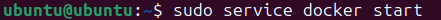

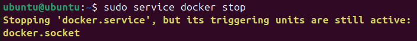

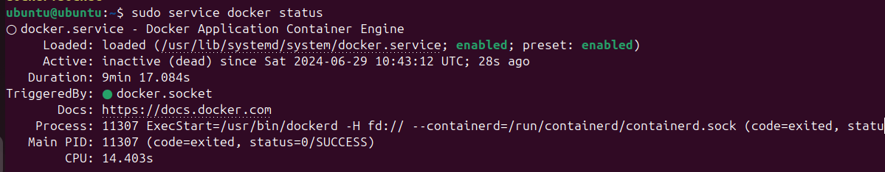

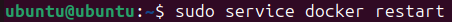

---

## 5. Image 映像檔指令

```bash
sudo docker images                  # 查詢本地所有映像檔
sudo docker search redis            # 搜尋 Docker Hub 上的映像檔
sudo docker pull redis              # 下載映像檔
sudo docker rmi <image_id>          # 刪除本地映像檔
```

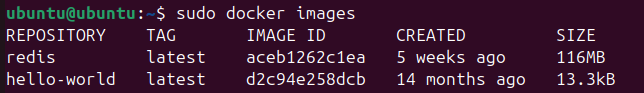

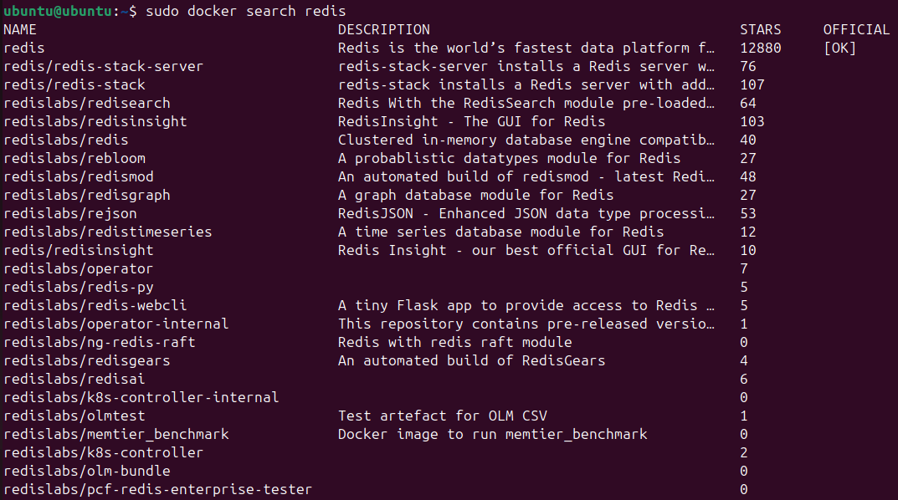

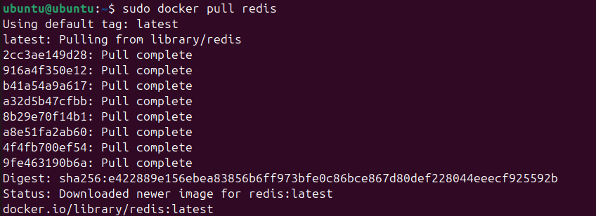

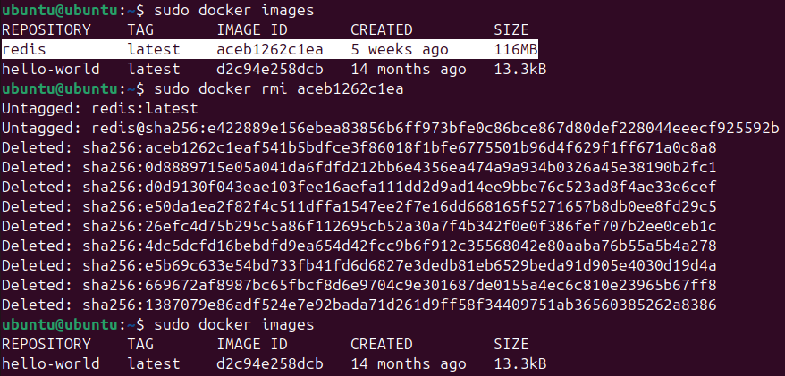

---

## 6. Container 容器指令

### 建立容器

```bash
# 前台容器（進入 bash，Redis 不自動啟動）
sudo docker run -it --name myredis redis /bin/bash

# 前台容器（直接進入 Redis CLI）
sudo docker run -it --name myredis redis

# 後台容器（detached mode，Redis 自動啟動）
sudo docker run -d --name=myredis redis
```

> 前台容器退出（`exit`）後容器會停止。按 `Ctrl+P` 再 `Ctrl+Q` 可讓容器在背景繼續運行。

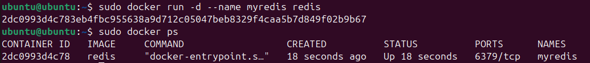

```bash
# 重新連接到運行中的容器
sudo docker exec -it myredis /bin/bash
```

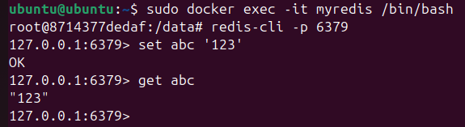

### 管理容器

```bash
sudo docker start <容器名稱或ID>      # 啟動已停止的容器
sudo docker stop <容器名稱或ID>       # 停止運行中的容器
sudo docker restart <容器名稱或ID>    # 重啟容器
sudo docker rm <容器名稱或ID>         # 刪除容器（需先停止）
sudo docker rm -f <容器名稱或ID>      # 強制刪除運行中的容器
```

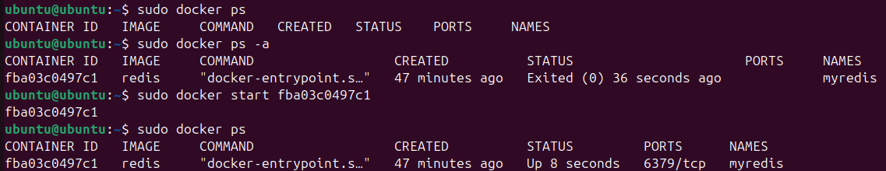

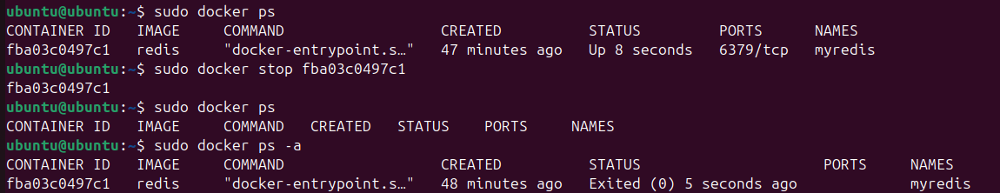

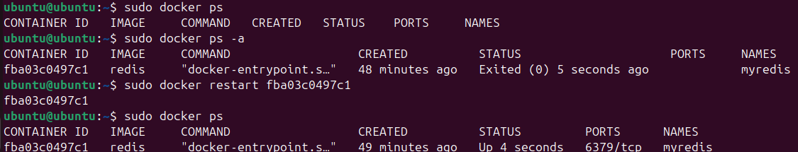

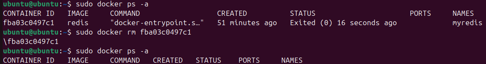

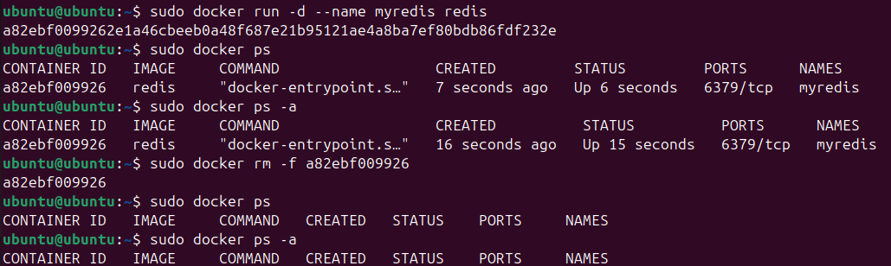

### 查看容器狀態

```bash
sudo docker ps      # 查看運行中的容器
sudo docker ps -a   # 查看所有容器（含已停止）
```

`docker ps` 欄位說明：

| 欄位 | 說明 |
|------|------|
| CONTAINER ID | 容器唯一識別碼 |
| IMAGE | 使用的映像檔名稱 |
| COMMAND | 啟動時執行的指令 |
| CREATED | 容器建立時間 |
| STATUS | 容器狀態（Up / Exited） |
| PORTS | 端口映射 |
| NAMES | 容器名稱 |

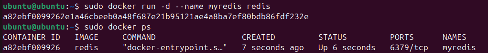

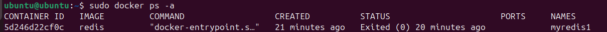

### 進入、監控與除錯

```bash
sudo docker exec -it <容器名稱或ID> /bin/bash   # 進入容器
sudo docker logs <容器名稱或ID>                  # 查看容器日誌
sudo docker logs -f <容器名稱或ID>               # 持續追蹤日誌
sudo docker inspect <容器名稱或ID>               # 查看容器詳細資訊
sudo docker stats <容器名稱或ID>                 # 查看資源使用情況
```

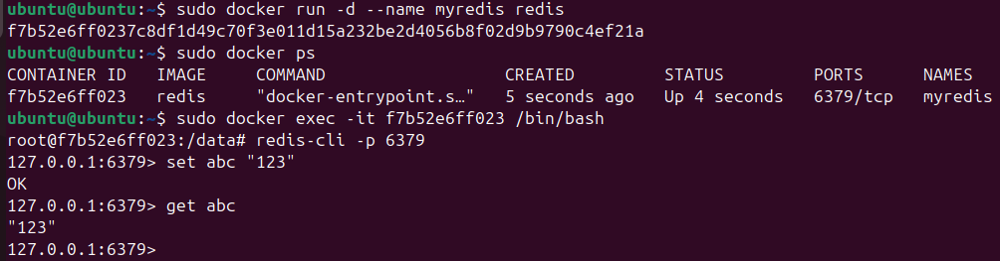

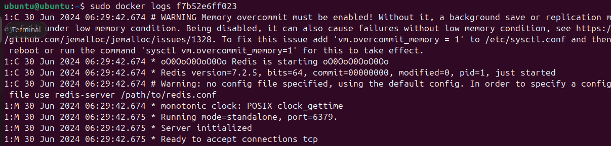

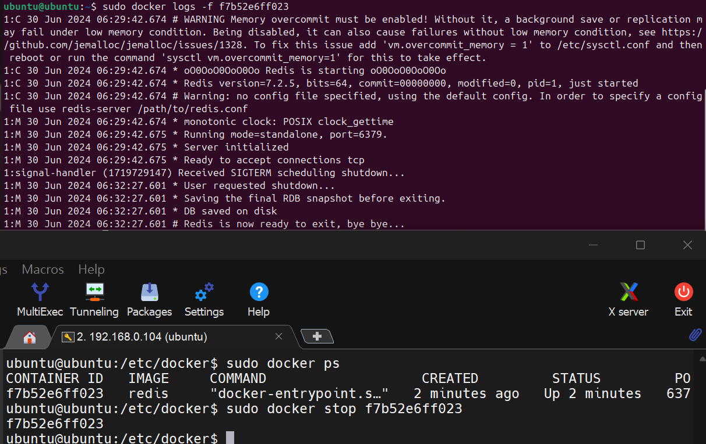

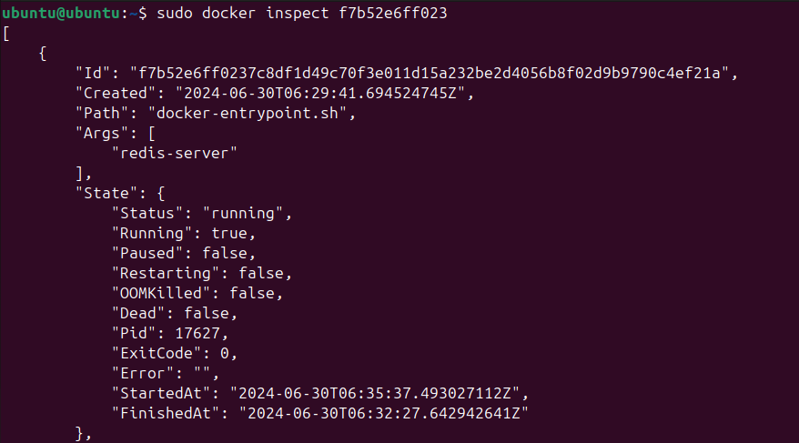

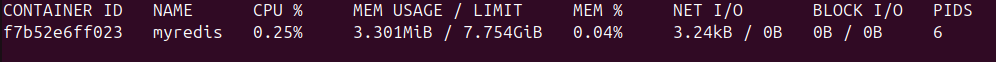

---

## 7. 檔案複製與目錄掛載

```bash
# 宿主機 → 容器
docker cp /home/hello.txt myredis:/usr/local/

# 容器 → 宿主機
docker cp myredis:/usr/local/hello.txt /home/
```

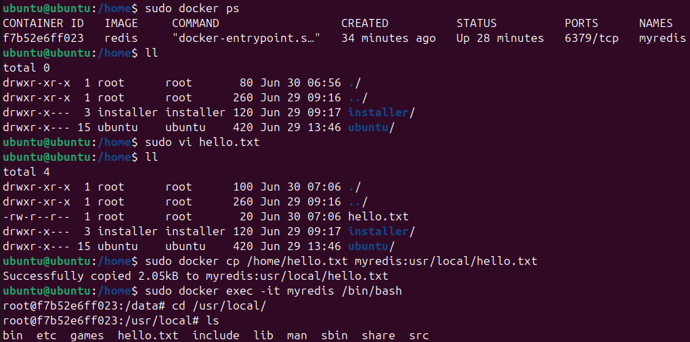

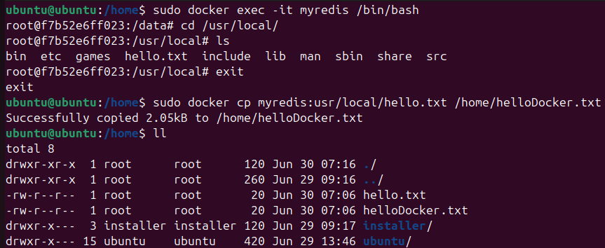

```bash
# 目錄掛載（容器與宿主機共享資料夾）
docker run -d --name myredis -v <宿主機路徑>:<容器路徑> redis
```

---

## 8. 安裝常用服務

### MySQL 8.0

```bash
docker pull mysql:8.0
docker run -di -p 3306:3306 --name=mysql -e MYSQL_ROOT_PASSWORD=password mysql:8.0

# 連線
mysql -h 127.0.0.1 -P 3306 -u root -p

# 進入容器
sudo docker exec -it mysql bash
mysql -u root -p
```

### Redis

```bash
docker pull redis
docker run -di --name=redis -p 6379:6379 redis

# 連線
redis-cli -p 6379

# 進入容器
sudo docker exec -it redis bash
redis-cli -p 6379
```

### Tomcat 9.0

```bash
docker pull tomcat:9.0
docker run -di --name tomcat -p 8080:8080 tomcat:9.0

# 部署 WAR 檔
docker cp your-app.war tomcat:/usr/local/tomcat/webapps/

# 設定掛載
docker run -d --name tomcat -p 8080:8080 \
  -v /path/to/server.xml:/usr/local/tomcat/conf/server.xml tomcat:9.0

# 設定 JVM 參數
docker run -d --name tomcat -p 8080:8080 \
  -e JAVA_OPTS="-Xmx512m -Xms256m" tomcat:9.0
```

> 注意：Tomcat 9.0 以上版本可能需要額外設定才能看到預設首頁。

---
