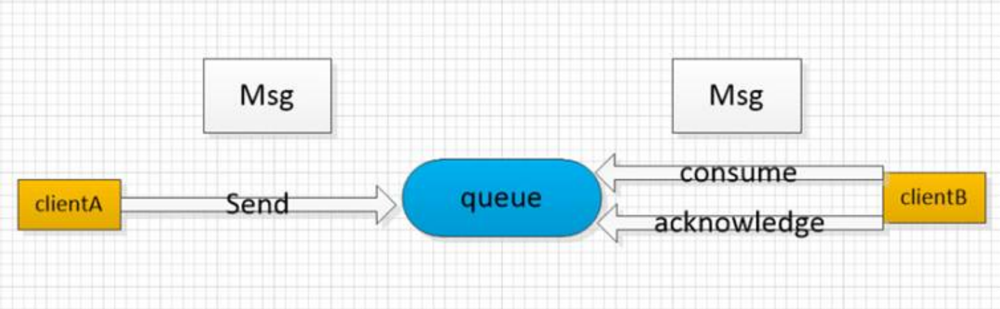
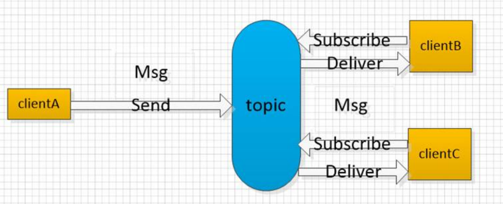
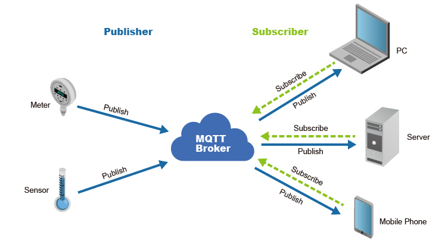
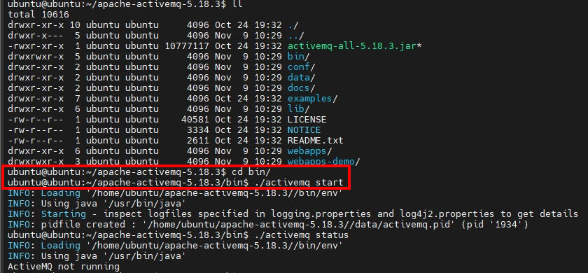
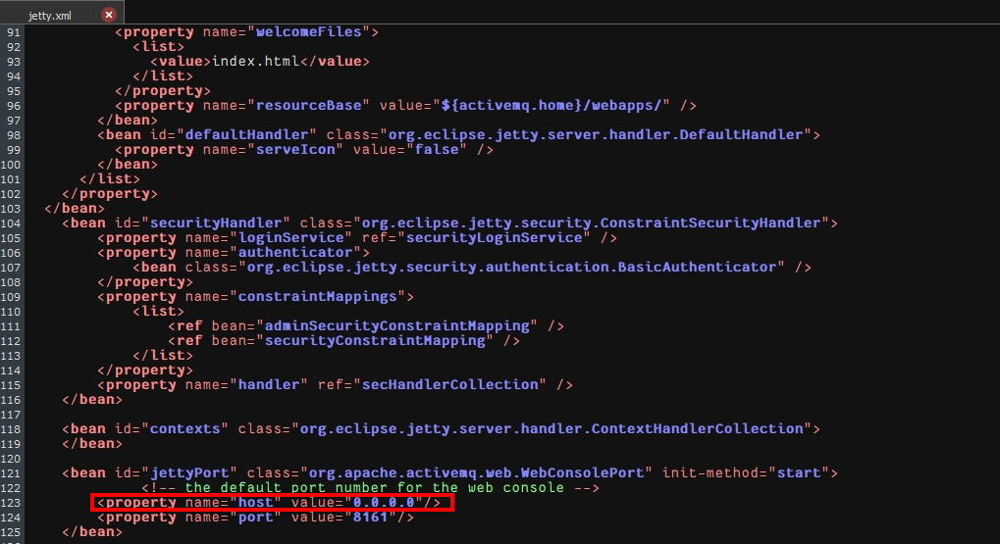

# JMS 與 ActiveMQ 完整實戰

JMS（Java Message Service）是 Java 平台的標準訊息傳遞 API，讓應用程式可以透過訊息佇列進行非同步通訊。本篇從概念、安裝到 Spring Boot 實作一路涵蓋。

> 參考專案：[Java_Message_Service](https://github.com/MinHao1103/Java_Message_Service)

---

## 1. 訊息模型概念

### 點對點模型（Point-to-Point / Queue）

- 角色：**Producer（生產者）**、**Queue（佇列）**、**Consumer（消費者）**
- 每則訊息只能被**一個** Consumer 消費，消費後從 Queue 移除
- Consumer 需發出 **Acknowledge（確認）** 通知訊息已處理
- Producer 與 Consumer **無時間依賴**，支援非同步處理



### 發佈訂閱模型（Publish/Subscribe / Topic）

- 角色：**Topic**、**Publisher（發佈者）**、**Subscriber（訂閱者）**
- Subscriber 必須**先訂閱** Topic，Publisher 才發佈訊息（有時間依賴）
- 每則訊息可同時傳送給**所有**訂閱者



### 兩種模型比較

| 模型 | 訊息接收者 | 時間依賴 |
|------|-----------|---------|
| **Queue（點對點）** | 一則訊息只能被一個 Consumer 接收 | 無 |
| **Topic（發佈訂閱）** | 一則訊息廣播給所有訂閱者 | 有（需先訂閱） |

---

## 2. MQTT 協定

**MQTT（Message Queuing Telemetry Transport）** 是輕量級的訊息傳遞協定，常用於 IoT（物聯網）裝置。

- 角色：**Publisher（發佈者）**、**Broker（代理伺服器）**、**Subscriber（訂閱者）**
- 由 Broker 統一轉發訊息，Publisher 與 Subscriber 不直接通訊



---

## 3. ActiveMQ 角色與用途

ActiveMQ 是基於 JMS 規範的訊息代理（Message Broker），負責在系統之間傳遞訊息。


| 用途 | 說明 |
|------|------|
| **非同步效能提升** | 生產者不需等待消費者處理完成即可繼續執行 |
| **系統解耦** | 生產者與消費者互相獨立，降低依賴 |
| **流量削峰** | 高峰期訊息堆入佇列，消費者依自身能力逐步處理 |

---

## 4. 安裝與環境設定（Ubuntu）

### 版本資訊

| 技術 | 版本 |
|------|------|
| Java | 11（ActiveMQ 5.18.3 需要 Java 11 才能啟動） |
| ActiveMQ | 5.18.3 |

> 注意：Java 8 的程式仍可正常連線並發送訊息給 ActiveMQ 5.18.3。

### 安裝步驟

**1. 安裝 JDK**

```bash
sudo apt install openjdk-11-jdk
```

**2. 下載 ActiveMQ 壓縮檔**

前往 [官方下載頁面](https://activemq.apache.org/components/classic/download/) 下載 `apache-activemq-5.18.3-bin.tar.gz`。

**3. 解壓縮並進入目錄**

```bash
tar -xzf apache-activemq-5.18.3-bin.tar.gz
cd /ubuntu/apache-activemq-5.18.3/
```

**4. 啟動 ActiveMQ**

```bash
./bin/activemq start
```



### 開放 WebConsole 外部存取

預設 WebConsole 僅供本地存取（`127.0.0.1`）。修改 `conf/jetty.xml`，將 `host` 改為 `0.0.0.0` 以允許外部連線。



瀏覽器輸入 `http://<server-ip>:8161`，預設帳號密碼皆為 `admin`（可在 `jetty-realm.properties` 調整）。

---

## 5. JMS API 介紹

### 核心物件

| 物件 | 說明 |
|------|------|
| **ConnectionFactory** | 建立 `Connection` 物件的工廠；分為 `QueueConnectionFactory`（佇列）與 `TopicConnectionFactory`（主題） |
| **Destination** | 訊息目的地；`Queue`（點對點）或 `Topic`（發佈訂閱） |
| **Connection** | 客戶端與 JMS 系統建立的連線（TCP/IP socket 封裝），可建立一個或多個 `Session` |
| **Session** | 用於操作訊息的介面，可建立 Producer、Consumer、訊息，並提供交易功能 |
| **Producer** | 由 `Session` 建立，將訊息發送至 `Destination`；`QueueSender` 或 `TopicPublisher` |
| **Consumer** | 由 `Session` 建立，接收 `Destination` 的訊息；`QueueReceiver` 或 `TopicSubscriber` |
| **MessageListener** | 訊息抵達時自動呼叫 `onMessage()`，用於非同步消費 |

---

## 6. 依賴設定

**非 Spring Boot 框架：**

```xml
<dependency>
    <groupId>org.apache.activemq</groupId>
    <artifactId>activemq-all</artifactId>
    <version>5.16.0</version>
</dependency>
```

**Spring Boot 框架：**

```xml
<dependency>
    <groupId>org.springframework.boot</groupId>
    <artifactId>spring-boot-starter-activemq</artifactId>
</dependency>
```

---

## 7. Spring Boot 設定重點

- 使用 `ActiveMQConfig.java` 設定 Bean，同時配置點對點（Queue）與發佈訂閱（Topic）模型
- 測試使用 `@SpringBootTest` 進行 JMS 傳送／接收整合測試

---
