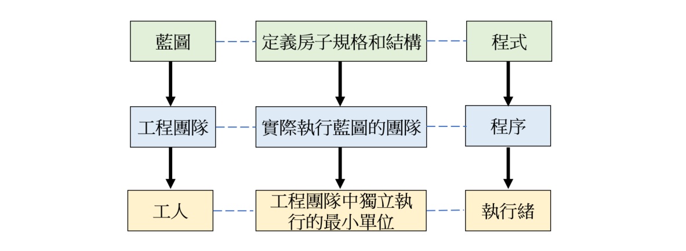
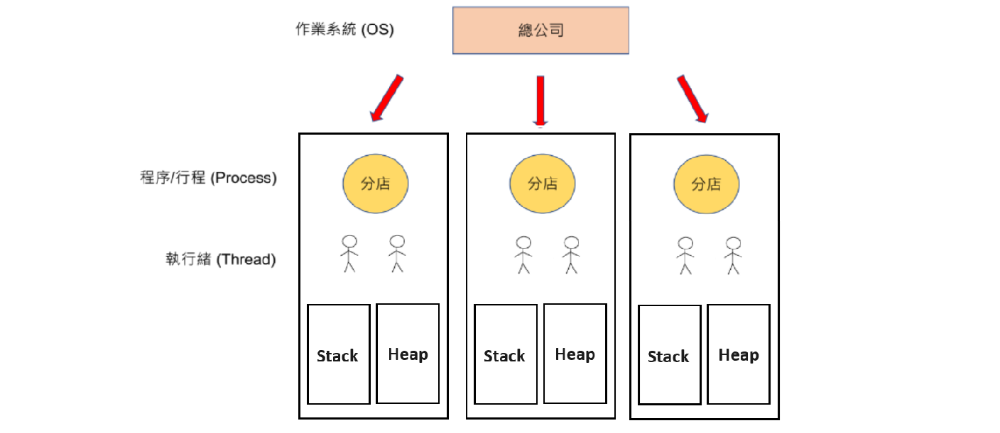

# Java Process 與 Thread 概念

這篇筆記說明程式、程序、執行緒的基本定義，以及 Stack 與 Heap 的差異，並透過生活比喻加深理解。

---

## 1. 基本定義

| 概念 | 說明 |
|------|------|
| **程式** | 在編輯器中撰寫的程式碼（靜態） |
| **程序 (Process)** | 程式被執行後載入記憶體，正在運行的實體 |
| **執行緒 (Thread)** | 程序中獨立執行的最小單位 |

比喻：蓋房子時需要「藍圖（程式）」、「工程團隊（程序）」及「工人（執行緒）」。

---

## 2. Process 的五種狀態

| 狀態 | 說明 |
|------|------|
| **New（新建）** | 建立新的工程團隊（程序剛被建立） |
| **Ready（就緒）** | 計劃與資源已準備就緒，等待 CPU 排程 |
| **Running（執行中）** | 工人開始執行各自的任務 |
| **Waiting（等待）** | 等待 I/O 或外部資源（如等待材料送達） |
| **Terminated（終止）** | 工程完成或中止，程序結束並釋放資源 |

---

## 3. Stack 與 Heap

### Stack（堆疊）

- **資料結構**：後進先出（LIFO）
- **操作**：`push`（加入頂端）、`pop`（移除頂端）
- **儲存方式**：連續記憶體空間，系統自動分配與釋放
- **特性**：存取速度快
- **應用**：方法呼叫的區域變數、瀏覽器的上一頁紀錄

### Heap（堆積）

- **資料結構**：樹狀結構（最大堆積 / 最小堆積），必為完整二元樹
- **儲存方式**：不連續，資料可分散在記憶體中
- **特性**：由程式人員手動分配與釋放
- **應用**：物件實例（`new` 關鍵字建立的物件）

### Stack vs Heap 比較

| 比較項目 | Stack | Heap |
|----------|-------|------|
| **資料結構** | 後進先出 | 樹狀 |
| **儲存方式** | 連續 | 不連續 |
| **存取速度** | 較快 | 較慢 |
| **分配方式** | 系統自動 | 程式人員手動 |

---

## 4. Process 與 Thread 的記憶體關係

以公司門市為比喻：

| 類比 | 技術概念 |
|------|----------|
| 分店 | Process（程序） |
| 員工 | Thread（執行緒） |
| 辦公空間 | Stack / Heap Memory |

- 每個分店（Process）都有**自己獨立的辦公空間**
- 不同分店（Process）的辦公空間**互相獨立**，無法直接存取
- 同一分店（Process）內的員工（Thread）可**共享**相同的辦公空間

---

## 5. 總結

- **Stack 和 Heap** 在資料結構、儲存方式和分配方式上不同
- **Process** 之間的記憶體是獨立的，互相不可存取
- **Thread** 在同一 Process 內可共享記憶體，因此需要注意競爭條件與同步問題

---
