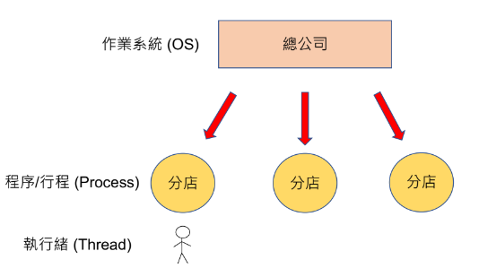
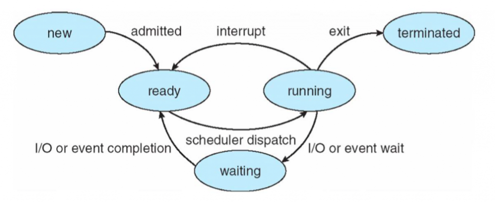
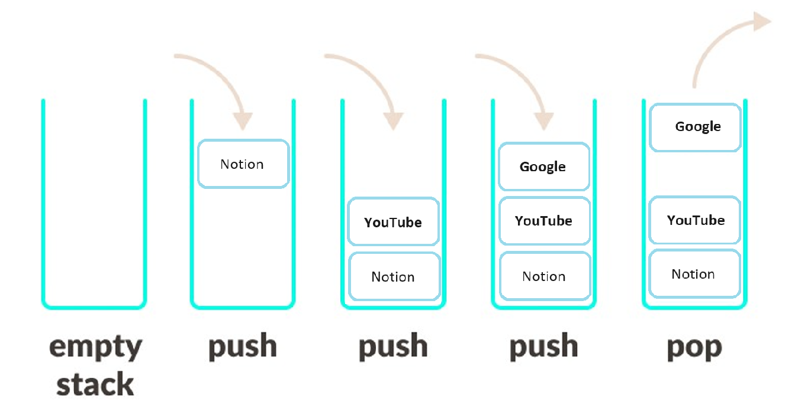
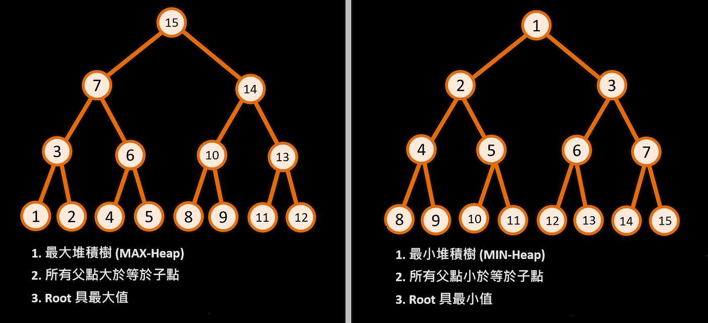
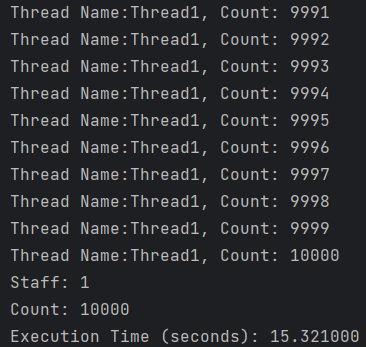
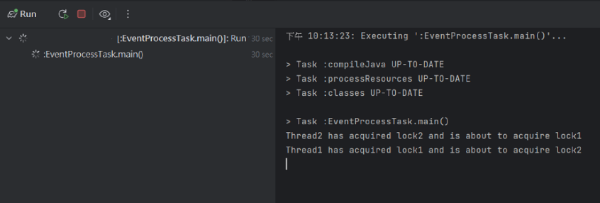

# Java 多執行緒：核心概念與同步實戰

這篇筆記從程式、程序、執行緒的基本定義出發，深入探討多執行緒環境下的競爭條件、同步控制與死鎖問題，並附上實戰程式碼與解法。

---

## 1. 基本定義

| 概念 | 說明 |
|------|------|
| **程式（Program）** | 在編輯器中撰寫的程式碼（靜態） |
| **程序（Process）** | 程式被執行後載入記憶體，正在運行的實體 |
| **執行緒（Thread）** | 程序中獨立執行的最小單位 |

> 比喻：蓋房子時需要「藍圖（程式）」、「工程團隊（程序）」及「工人（執行緒）」。



---

## 2. Process 的五種狀態

| 狀態 | 說明 |
|------|------|
| **New（新建）** | 程序剛被建立 |
| **Ready（就緒）** | 計劃與資源已備妥，等待 CPU 排程 |
| **Running（執行中）** | 工人開始執行各自的任務 |
| **Waiting（等待）** | 等待 I/O 或外部資源 |
| **Terminated（終止）** | 工程完成或中止，程序結束並釋放資源 |



---

## 3. Stack 與 Heap 記憶體

| 比較項目 | Stack | Heap |
|----------|-------|------|
| **資料結構** | 後進先出（LIFO） | 樹狀結構 |
| **儲存方式** | 連續記憶體 | 不連續 |
| **存取速度** | 較快 | 較慢 |
| **分配方式** | 系統自動 | 程式人員手動（`new` 關鍵字） |
| **典型用途** | 方法呼叫的區域變數 | 物件實例 |



---

## 4. Process 與 Thread 的記憶體關係

以公司門市為比喻：

| 類比 | 技術概念 |
|------|----------|
| 分店 | Process（程序） |
| 員工 | Thread（執行緒） |
| 辦公空間 | Stack / Heap Memory |

- **不同 Process** 的記憶體互相獨立，無法直接存取
- **同一 Process 內的 Thread** 共享記憶體，因此需要注意同步問題



---

## 5. 多執行緒實戰

### 單執行緒範例

```java
public class EventProcessTask implements Runnable {
    private static int staff = 1;
    private int count = 0;
    private int totalEvents = 10000;

    @Override
    public void run() {
        for (int i = 1; i <= totalEvents / staff; i++) {
            try { Thread.sleep(1); } catch (InterruptedException e) { e.printStackTrace(); }
            count++;
            System.out.println("Thread: " + Thread.currentThread().getName() + ", Count: " + count);
        }
    }

    public static void main(String[] args) throws InterruptedException {
        long startTime = System.currentTimeMillis();
        EventProcessTask task = new EventProcessTask();
        Thread[] threads = new Thread[staff];

        for (int i = 0; i < staff; i++) {
            threads[i] = new Thread(task, "Thread" + (i + 1));
            threads[i].start();
        }
        for (int i = 0; i < staff; i++) threads[i].join();

        System.out.println("Count: " + task.count);
        System.out.printf("Execution Time: %f sec%n",
            (System.currentTimeMillis() - startTime) / 1000.0);
    }
}
```

---

## 6. 競爭條件（Race Condition）

將 `staff = 2` 後，兩條執行緒同時處理任務，執行時間縮短但**總事件數不到一萬**。

**原因：** `count++` 並非原子操作，實際包含三個步驟：
1. 讀取 `count` 的值
2. 將值加 1
3. 將結果寫回 `count`

當 A、B 兩條執行緒同時讀取 `count = 0`，各自加 1 後寫回，最終結果是 `1` 而非 `2`。



---

## 7. `synchronized` 互斥鎖

使用 `synchronized` 確保同一時間只有一條執行緒能執行關鍵區塊：

```java
@Override
public void run() {
    for (int i = 1; i <= totalEvents / staff; i++) {
        try { Thread.sleep(3); } catch (InterruptedException e) { e.printStackTrace(); }

        synchronized (this) {
            count++;
        }
        System.out.println("Thread: " + Thread.currentThread().getName() + ", Count: " + count);
    }
}
```

> ⚠️ **注意**：鎖的區塊過大會導致效能問題，應精準控制鎖的範圍。

**現代替代方案：**
- `AtomicInteger`（底層基於 CAS 樂觀鎖）：效能遠高於加鎖的 `int`
- `ConcurrentHashMap`：取代 `Hashtable`，執行緒安全且效能更好
- `ReentrantLock.tryLock(timeout)`：帶超時機制的鎖，可避免死鎖

---

## 8. 死鎖（Deadlock）

多執行緒**互相等待**對方釋放鎖，導致程序無法繼續執行：

```java
private static final String LOCK1 = "lock1";
private static final String LOCK2 = "lock2";

@Override
public void run() {
    Object firstLock  = (Math.random() < 0.5) ? LOCK1 : LOCK2;
    Object secondLock = (firstLock == LOCK1)   ? LOCK2 : LOCK1;

    synchronized (firstLock) {
        System.out.println(Thread.currentThread().getName() + " acquired " + firstLock);
        synchronized (secondLock) {
            count++;
        }
    }
}
```

**防範死鎖的方式：**
- 確保所有執行緒獲取鎖的**順序保持一致**
- 使用帶有 Timeout 的鎖：`ReentrantLock.tryLock(timeout, TimeUnit.SECONDS)`



---

## 9. 輪詢模式（Polling）

### 重試模式（固定次數）

```java
int maxRetries = 2;
int retryDelay = 1000;

for (int retryCount = 0; retryCount < maxRetries; retryCount++) {
    try {
        return executeRequest();
    } catch (Exception e) {
        Log.d(TAG, "Exception: " + e.getMessage());
    }
    if (retryCount < maxRetries - 1) {
        try { Thread.sleep(retryDelay); } catch (InterruptedException ignored) {}
    }
}
```

### 輪詢模式（固定間隔）

```java
int maxRetries = 2;
long retryDelay = 1000;

for (int retryCount = 1; retryCount <= maxRetries; retryCount++) {
    try {
        return executeRequest();
    } catch (InterruptedException e) {
        continue;
    }
    Thread.sleep(retryDelay);
}
```

---

## 10. 總結

| 概念 | 重點 |
|------|------|
| **競爭條件** | 共享資源同時存取導致資料不一致 |
| `synchronized` | 悲觀鎖，確保互斥，但需精準控制鎖的範圍 |
| `AtomicInteger` | 樂觀鎖（CAS），計數器首選 |
| **死鎖** | 多執行緒互相等待；解法：固定鎖順序或帶 Timeout 的鎖 |
| **執行緒池** | 生產環境一律使用 `ExecutorService`，禁止直接 `new Thread()` |

---
