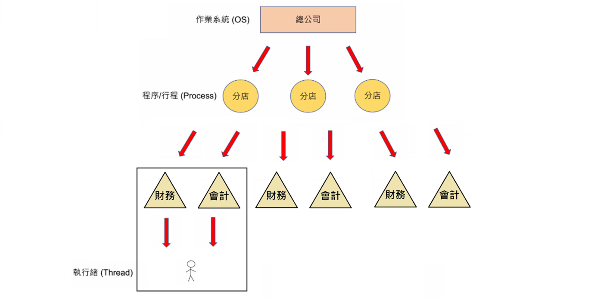
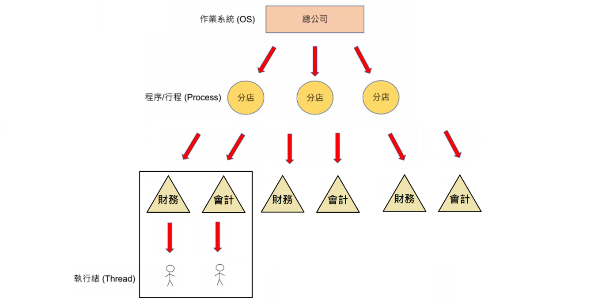
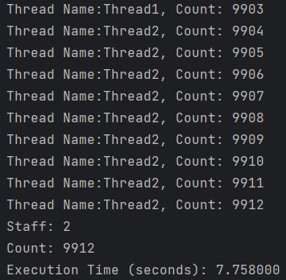
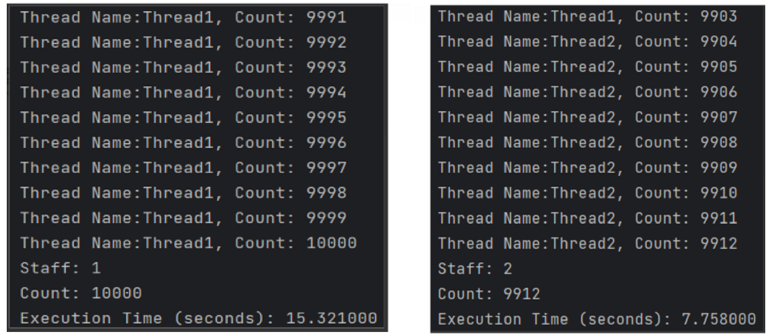
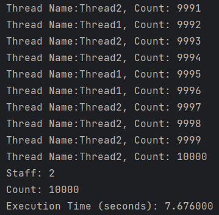
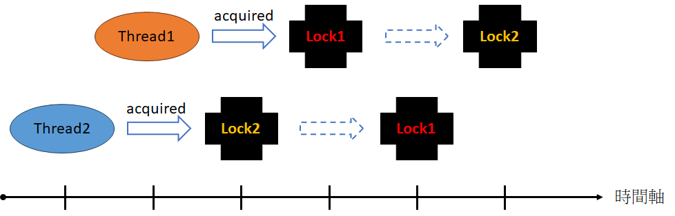
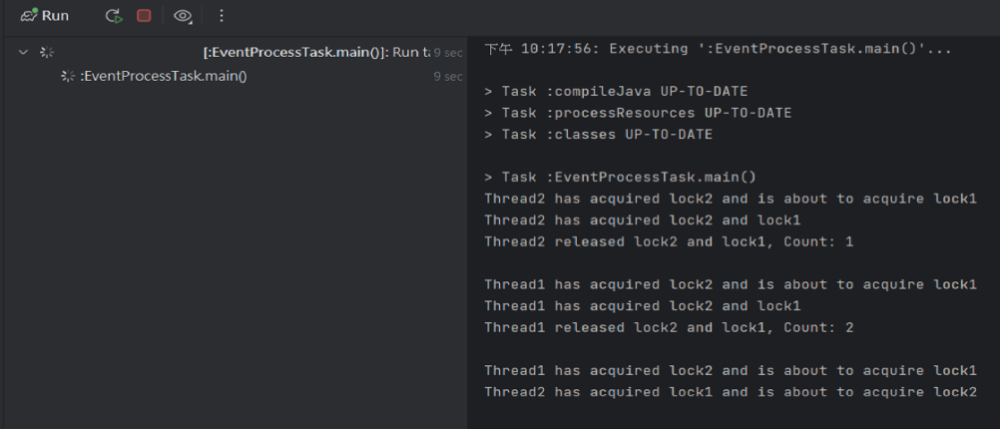

# Java 多執行緒與同步控制

這篇筆記涵蓋 Java 多執行緒的核心概念，包含競爭條件、synchronized 互斥鎖、死鎖分析，以及輪詢模式實作。

---

## 1. 核心概念

- **執行緒**：程序中獨立執行的最小單位
- **多執行緒目的**：提高程式的執行速度與效能，讓多個任務同時進行

---

## 2. 單執行緒範例（staff = 1）

```java
public class EventProcessTask implements Runnable {

    private static int staff = 1;
    private int count = 0;
    private int totalEvents = 10000;

    @Override
    public void run() {
        for (int i = 1; i <= totalEvents / staff; i++) {
            try {
                Thread.sleep(1);
            } catch (InterruptedException e) {
                e.printStackTrace();
            }
            count++;
            System.out.println("Thread Name:" + Thread.currentThread().getName() + ", Count: " + count);
        }
    }

    public static void main(String[] args) throws InterruptedException {
        long startTime = System.currentTimeMillis();
        EventProcessTask task = new EventProcessTask();
        Thread[] threads = new Thread[staff];

        for (int i = 0; i < staff; i++) {
            threads[i] = new Thread(task, "Thread" + (i + 1));
            threads[i].start();
        }

        for (int i = 0; i < staff; i++) {
            threads[i].join();
        }

        System.out.println("Staff: " + task.staff);
        System.out.println("Count: " + task.count);
        System.out.println(String.format("Execution Time (seconds): %f",
                (System.currentTimeMillis() - startTime) / 1_000.0));
    }
}
```


---

## 3. 雙執行緒與競爭條件（Race Condition）

將 `staff = 2`，兩條執行緒同時處理任務：

```java
private static int staff = 2;
```





執行後發現：總執行時間縮短，但完成的事件總數**不到一萬**。

**原因：競爭條件（Race Condition）**

`count++` 並非原子操作，實際包含三個步驟：
1. 讀取 `count` 的值
2. 將值加 1
3. 將結果寫回 `count`

當 A、B 兩條執行緒同時讀取 `count = 0`，各自加 1 後寫回，最終結果是 `1` 而非 `2`。


---

## 4. synchronized 互斥鎖

使用 `synchronized` 確保同一時間只有一條執行緒能執行關鍵區塊：

```java
@Override
public void run() {
    for (int i = 1; i <= totalEvents / staff; i++) {
        try {
            Thread.sleep(3);
        } catch (InterruptedException e) {
            e.printStackTrace();
        }

        synchronized (this) {
            count++;
        }
        System.out.println("Thread Name:" + Thread.currentThread().getName()
                + ", Count: " + count);
    }
}
```





> 注意：鎖的區塊過大可能導致效能問題，應精準控制鎖的範圍。

---

## 5. 死鎖（Deadlock）

多執行緒**互相等待**對方釋放鎖，導致程序無法繼續執行：

```java
private static final String LOCK1 = "lock1";
private static final String LOCK2 = "lock2";

@Override
public void run() {
    for (int i = 1; i <= totalEvents / staff; i++) {
        try {
            Thread.sleep(1);
        } catch (InterruptedException e) {
            e.printStackTrace();
        }

        Object firstLock, secondLock;
        firstLock = (Math.random() < 0.5) ? LOCK1 : LOCK2;
        secondLock = (firstLock == LOCK1) ? LOCK2 : LOCK1;

        synchronized (firstLock) {
            System.out.println(String.format("%s has acquired %s and is about to acquire %s",
                    Thread.currentThread().getName(), firstLock, secondLock));
            synchronized (secondLock) {
                System.out.println(String.format("%s has acquired %s and %s",
                        Thread.currentThread().getName(), firstLock, secondLock));
                count++;
            }
            System.out.println(String.format("%s released %s and %s, Count: %d%n",
                    Thread.currentThread().getName(), firstLock, secondLock, count));
        }
    }
}
```




---

## 6. 總結

| 概念 | 說明 |
|------|------|
| **執行緒** | 程序中獨立執行的最小單位 |
| **多執行緒** | 提高程式執行速度與效能 |
| **競爭條件** | 同時存取共享資源時發生的資料不一致問題 |
| **互斥鎖** | `synchronized` 避免競爭條件，但需精準控制鎖的範圍以避免效能問題 |
| **死鎖** | 多個執行緒互相等待釋放鎖，導致程序無法繼續執行 |





---

## 7. 輪詢模式（Polling）

### 重試模式（固定次數）

```java
int maxRetries = 2;
int retryDelay = 1000;

for (int retryCount = 0; retryCount < maxRetries; retryCount++) {
    try {
        // 執行 HTTP 請求
        return result;
    } catch (Exception e) {
        Log.d(TAG, "Exception: " + e.getMessage());
    }

    if (retryCount < maxRetries - 1) {
        try {
            Thread.sleep(retryDelay);
        } catch (InterruptedException ignored) {
        }
    }
}
```

### 輪詢模式（固定間隔）

```java
int maxRetries = 2;
long retryDelay = 1000; // 輪詢間隔 1 秒

for (int retryCount = 1; retryCount <= maxRetries; retryCount++) {
    try {
        // 執行 HTTP 請求
        return result;
    } catch (InterruptedException e) {
        Log.d(TAG, "Polling sleep interrupted. Continuing to the next iteration.");
        continue;
    }
    Thread.sleep(retryDelay);
}
```

---
