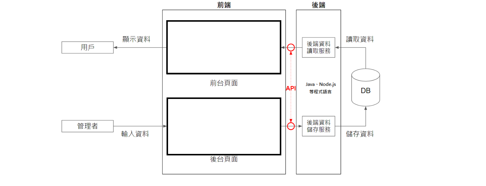
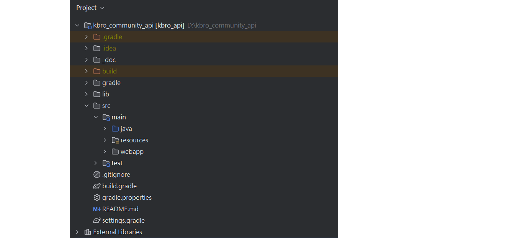
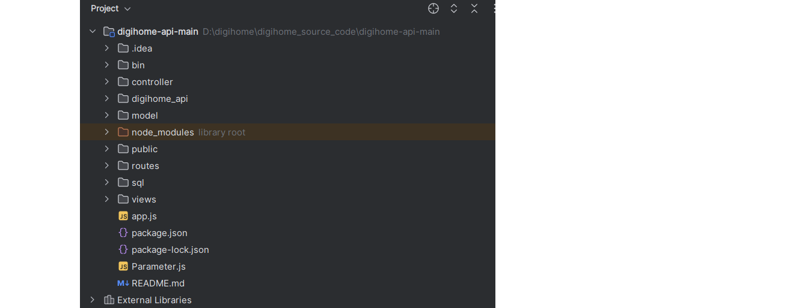

# Java 與 Node.js 開發比較

Java 和 Node.js 都可以為前端提供存取資料庫的 API，核心概念相同，差異在於語法、依賴管理和專案結構。



---

## 1. 型別系統

| 比較 | Java | Node.js |
|------|------|---------|
| **型別** | 強型別，需明確宣告型別 | 弱型別，統一使用 `let` / `const` |
| **範例** | `int count = 0;` `String name = "John";` | `let count = 0;` `let name = "John";` |

---

## 2. 依賴管理

| 比較 | Java | Node.js |
|------|------|---------|
| **工具** | Maven (`pom.xml`) 或 Gradle (`build.gradle`) | npm (`package.json`) |





---

## 3. 專案目錄結構

**Java（Gradle 標準佈局）：**

```
src/
├── main/
│   ├── java/        ← 主程式碼
│   └── resources/   ← 設定檔（application.properties 等）
└── test/
    └── java/        ← 測試程式碼
```

**Node.js：**

```
project/
├── src/
│   ├── routes/      ← API 路由
│   ├── controllers/ ← 控制器
│   └── models/      ← 資料模型
├── package.json
└── index.js
```

---

## 4. 資料庫存取（DAO 層）

**Java（JDBC PreparedStatement）：**

```java
String sql = "SELECT * FROM users WHERE id = ?";
PreparedStatement ps = connection.prepareStatement(sql);
ps.setInt(1, userId);
ResultSet rs = ps.executeQuery();
```

**Node.js（呼叫 Stored Procedure）：**

```javascript
connection.query('CALL getUserById(?)', [userId], (err, results) => {
    if (err) throw err;
    console.log(results);
});
```

> Node.js 也可以直接下 SQL，使用 Stored Procedure 只是其中一種方式。

---

## 5. 總結

概念相同，差異在於實作方式：

| 面向 | Java | Node.js |
|------|------|---------|
| 語言特性 | 強型別、編譯語言 | 弱型別、直譯語言 |
| 依賴管理 | Maven / Gradle | npm / yarn |
| 非同步模型 | 多執行緒 | 單執行緒 Event Loop |
| 常見框架 | Spring Boot | Express / NestJS |

---
