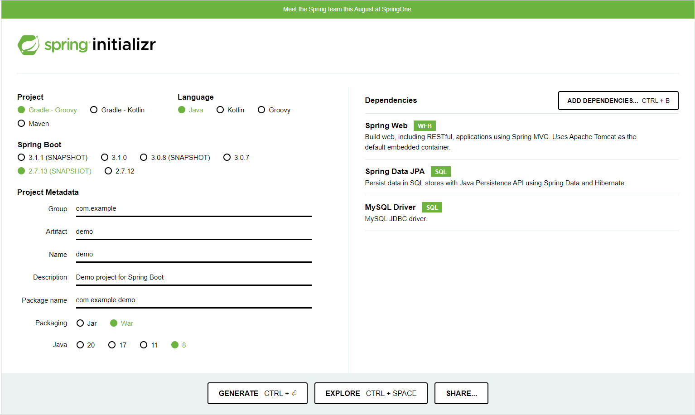
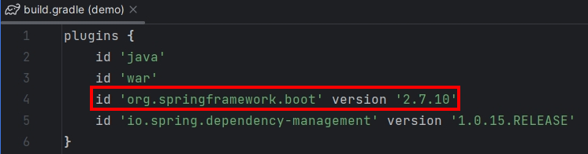
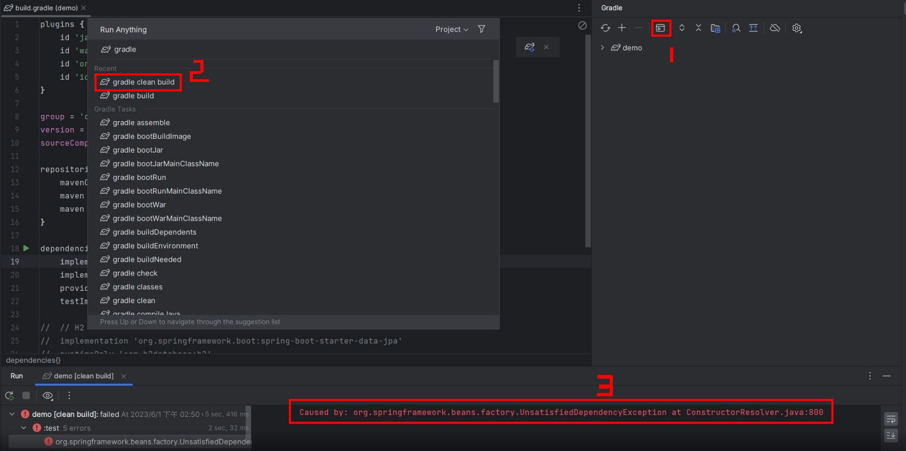
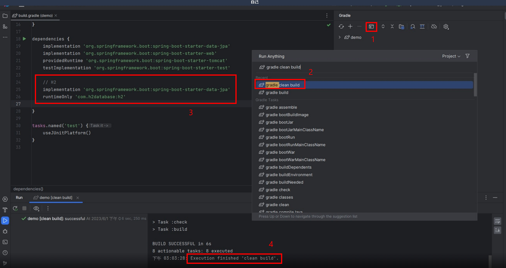
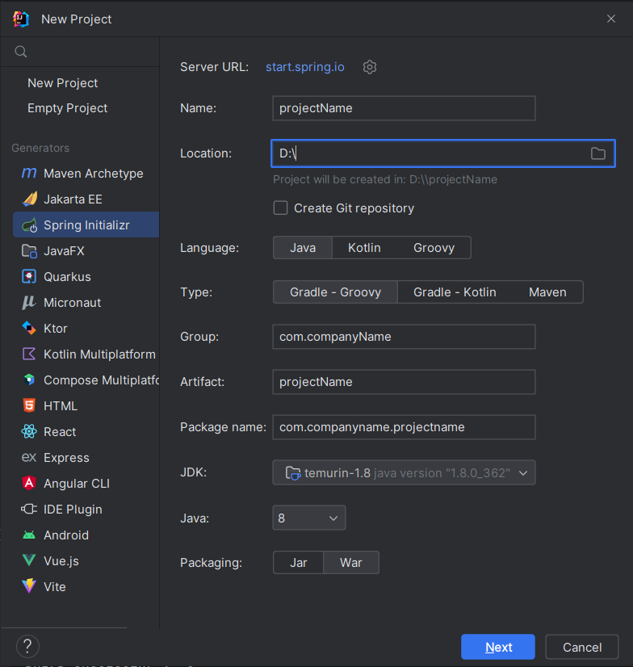
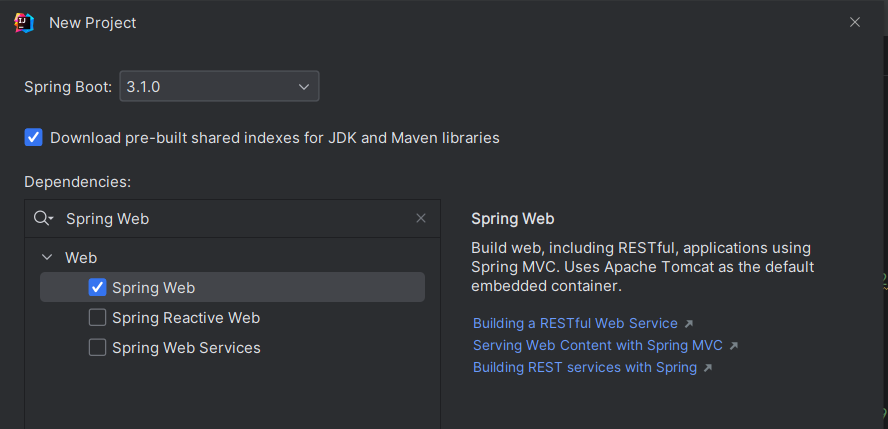
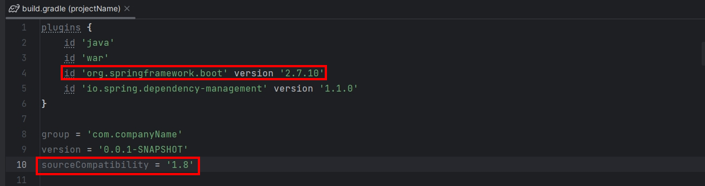
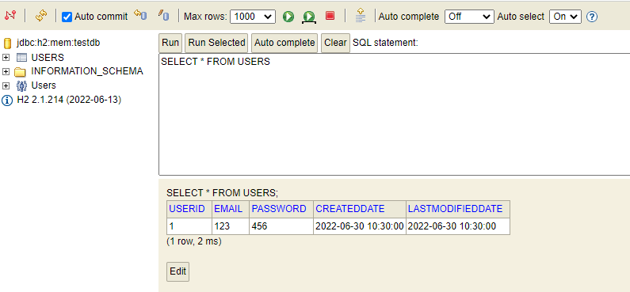

# Spring Boot 專案建置與 H2 設定

這篇筆記記錄了使用 Spring Initializr 建立 Spring Boot 專案、配置 Gradle 依賴，以及整合 H2 記憶體資料庫的完整流程。

---

## 1. Spring Initializr 建立專案

前往 [start.spring.io](https://start.spring.io) 進行以下設定：

| 項目 | 設定值 |
|------|--------|
| Project | Gradle - Groovy |
| Language | Java |
| Spring Boot | 2.7.10 |
| Group | com.companyName |
| Artifact | projectName |
| Packaging | War |
| Java | 8 |
| Dependencies | Spring Web、Spring Data JPA、MySQL Driver |









---

## 2. build.gradle 插件說明

```groovy
plugins {
    id 'java'                                                // 允許編譯與執行 Java 程式碼
    id 'war'                                                 // 建置 WAR 檔以部署至 Java Web 伺服器
    id 'org.springframework.boot' version '2.7.10'          // Spring Boot Gradle 插件
    id 'io.spring.dependency-management' version '1.1.0'    // 管理依賴庫版本
}

group = 'com.companyName'       // 專案所屬群組
version = '0.0.1-SNAPSHOT'      // 專案版本號
sourceCompatibility = '1.8'     // Java 編譯器源碼相容性版本
```



---

## 3. 依賴設定

```groovy
dependencies {
    // MySQL
    implementation 'mysql:mysql-connector-java:8.0.27'

    // H2（開發/測試用記憶體資料庫）
    implementation 'org.springframework.boot:spring-boot-starter-data-jpa'
    runtimeOnly 'com.h2database:h2'
}
```



> 💡 Tip: 新建專案的 `src/test` 目錄在沒有資料庫驅動時執行測試會報錯（`UnsatisfiedDependencyException`），暫時加入 H2 依賴即可解決。

---

## 4. Tomcat 設定

| 項目 | 說明 |
|------|------|
| Name | Apache Tomcat/x.x.xx |
| Deployment | 指定專案路徑下的 java 資料夾 |
| Module | 例如 `demo.main` |
| Context Path | `demo` |
| Server Port | `8080` |



---

## 5. H2 資料庫設定

### 步驟一：build.gradle

```groovy
dependencies {
    runtimeOnly 'com.h2database:h2'
}
```

### 步驟二：application.properties

```properties
# H2 資料庫配置
spring.datasource.url=jdbc:h2:mem:testdb
spring.datasource.driver-class-name=org.h2.Driver
spring.datasource.username=sa
spring.datasource.password=
spring.jpa.database-platform=org.hibernate.dialect.H2Dialect
spring.h2.console.enabled=true
```

### 步驟三：啟動後存取 H2 Console

瀏覽器輸入：`http://localhost:8080/h2-console/`



### 步驟四：schema.sql（自動建表）

```sql
CREATE TABLE IF NOT EXISTS users
(
    userId           INT          NOT NULL PRIMARY KEY AUTO_INCREMENT,
    email            VARCHAR(256) NOT NULL UNIQUE,
    password         VARCHAR(256) NOT NULL,
    createdDate      TIMESTAMP    NOT NULL,
    lastModifiedDate TIMESTAMP    NOT NULL
);
```

### 步驟五：data.sql（初始資料）

```sql
INSERT INTO `users` (`email`, `password`, `createdDate`, `lastModifiedDate`)
VALUES ('123', '456', '2022-06-30 10:30:00', '2022-06-30 10:30:00');
```

---
