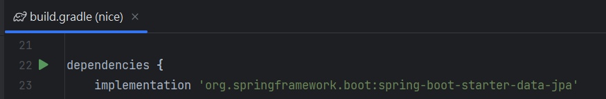
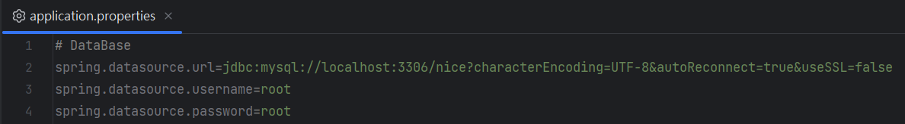
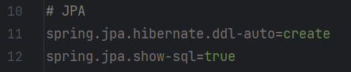
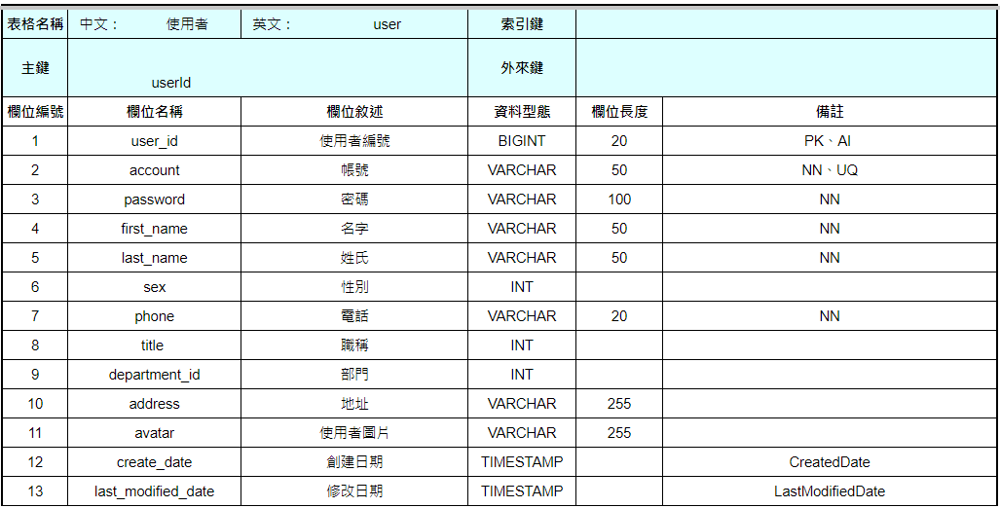
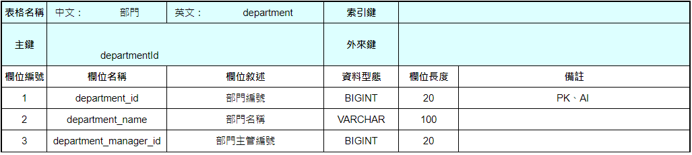

# Spring Data JPA 與三層架構實作

這篇筆記涵蓋 Spring Data JPA 的 Entity 設計、多對多關聯映射，以及 Controller → Service → Dao 三層架構的標準實作方式。

---

## 1. Spring Data JPA 設定

### application.properties

```properties
# MySQL 連線設定（請替換紅色部分）
spring.datasource.url=jdbc:mysql://localhost:3306/nice?characterEncoding=UTF-8&autoReconnect=true&useSSL=false
spring.datasource.username=root
spring.datasource.password=root
```





**關鍵設定說明：**

| 設定 | 說明 |
|------|------|
| `spring.jpa.hibernate.ddl-auto` | 控制 Hibernate 如何處理資料表的建立與更新。`create` 會在啟動時刪除並重建，正式環境建議使用 `update` 或 `none` |
| `spring.jpa.show-sql` | 將 Hibernate 生成的 SQL 輸出到控制台，正式環境設為 `false` |

---

## 2. Entity 設計

### User 實體

```java
@Entity
@Table(name = "user")
@EntityListeners(AuditingEntityListener.class)
@Getter
@Setter
@NoArgsConstructor
@AllArgsConstructor
@Accessors(chain = true)
public class User {

    @Id
    @GeneratedValue(strategy = GenerationType.IDENTITY)
    @Column(name = "user_id")
    @Schema(description = "使用者編號")
    private Long user_id;

    @Column(name = "account", unique = true, length = 50)
    @Schema(description = "帳號")
    private String account;

    @Column(name = "password", length = 100)
    @Schema(description = "密碼")
    @JsonIgnore
    private String password;

    @Column(name = "first_name", length = 50)
    @Schema(description = "名字")
    private String first_name;

    @Column(name = "last_name", length = 50)
    @Schema(description = "姓氏")
    private String last_name;

    @Column(name = "sex")
    @Schema(description = "性別（0: 男生, 1: 女生, 2: 其他）")
    private Integer sex;

    @Column(name = "phone", length = 20)
    @Schema(description = "電話")
    private String phone;

    @Column(name = "title")
    @Schema(description = "職稱")
    private Integer title;

    @Column(name = "department_id")
    @Schema(description = "部門")
    private Integer department_id;

    @Column(name = "address", length = 255)
    @Schema(description = "地址")
    private String address;

    @Column(name = "avatar", length = 255)
    @Schema(description = "使用者圖片")
    private String avatar;

    @CreatedDate
    @Column(name = "create_date", columnDefinition = "TIMESTAMP")
    @Schema(description = "創建日期")
    private Timestamp create_date;

    @LastModifiedDate
    @Column(name = "last_modified_date", columnDefinition = "TIMESTAMP")
    @Schema(description = "修改日期")
    private Timestamp last_modified_date;
}
```



### Department 實體

```java
@Entity
@Table(name = "department")
@Getter
@Setter
@NoArgsConstructor
@AllArgsConstructor
@Accessors(chain = true)
public class Department {

    @Id
    @GeneratedValue(strategy = GenerationType.IDENTITY)
    @Column(name = "department_id")
    @Schema(description = "部門編號")
    private Long department_id;

    @Column(name = "account", length = 100)
    @Schema(description = "部門名稱")
    private String department_name;

    @Column(name = "department_manager_id")
    @Schema(description = "部門主管編號")
    private Long department_manager_id;
}
```



---

## 3. 多對多關聯映射

```java
// User.java
@ManyToMany(targetEntity = Department.class)
@JoinTable(
        name = "user_department",
        joinColumns = @JoinColumn(name = "user_id"),
        inverseJoinColumns = @JoinColumn(name = "department_id")
)
private Set<Department> departments = new HashSet<>();

// Department.java
@ManyToMany(mappedBy = "departments")
private Set<User> users = new HashSet<>();
```



---

## 4. Controller、Service、Dao 三層架構

### Controller 層

- `@RestController`：RESTful 風格控制器，處理 HTTP 請求並回傳結果
- `@Autowired`：自動將依賴的 Bean 注入到 class 中
- `@GetMapping`：簡化處理 GET 請求（RESTful API）

```java
@Tag(name = "測試 Controller")
@RestController
public class TestController {

    private Logger log = LoggerFactory.getLogger(this.getClass());

    @Autowired
    private TestService testService;

    public Boolean getTest(HttpServletRequest request) {
        return testService.getTest(request);
    }
}
```

### Service 層

- `@Service`：標記為 Service 層 Bean

```java
@Service
public class TestService {

    @Autowired
    private TestDao testDao;

    public Boolean getTest(HttpServletRequest request) {
        return testDao.getTest(request);
    }
}
```

### Dao 層

- `@Repository`：標記為資料存取層 Bean
- 使用 Spring JDBC 的 `NamedParameterJdbcTemplate` 執行 SQL

```java
@Repository
public abstract class GeneralDao {
    public abstract NamedParameterJdbcTemplate getJdbcTemplate();
}
```

```java
@Repository
public class TestDao extends GeneralDao {

    private Logger log = LoggerFactory.getLogger(this.getClass());

    @Autowired
    private NamedParameterJdbcTemplate namedParameterJdbcTemplate;

    @Override
    public NamedParameterJdbcTemplate getJdbcTemplate() {
        return namedParameterJdbcTemplate;
    }

    public Boolean getTest(HttpServletRequest request) {
        StringBuilder sql = new StringBuilder();
        sql.append(" SELECT * FROM house WHERE houseId = :houseId ");

        ShowMapSqlParameterSource ps = new ShowMapSqlParameterSource();
        ps.addValue("houseId", houseId);

        log.info("Method: {}, SQL: {}, Parameters: {}",
                "getTest", sql, ps.getValues());
        return getJdbcTemplate().queryForObject(sql.toString(), ps, Boolean.class);
    }
}
```

---
